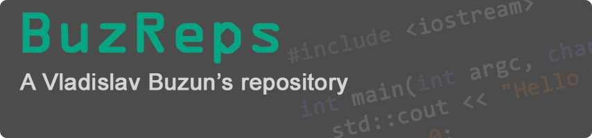

# 

##  Hello there

Hi, i am Vladislav, a 20 year old student from Belarus.

## Fields of interest

I’m interested in desktop software development, especially in native apps written on C/C++.

 

  <strong>Full list of tools and technologies i had experience with:</strong>
  

* IDE:
  * MS Visual Studio  
  * Qt Creator / Designer
  * CLion
* API:
  * WinAPI
  * POSIX
  * OpenGL
* Tools:
  * Make
  * Doxygen
* Guidelines and code styles:
  * [CppCoreGuidelines](https://isocpp.github.io/CppCoreGuidelines/CppCoreGuidelines)
  * [Google code style](https://google.github.io/styleguide/cppguide.html)
* Frameworks and libraries:
  * Qt
  * [googletest](https://github.com/google/googletest)
  * etc.
* Other
  * OpenMP, OpenCL
  * PL/SQL
  * JavaEE (Maven, GlassFish, JSP, JPA, Beans, Vert.x)
  * C#

## GitHub Stats

